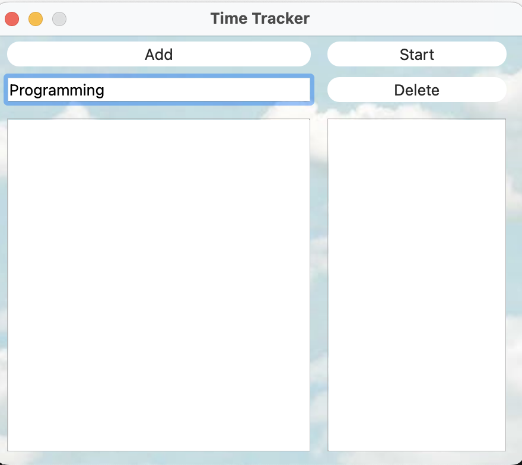
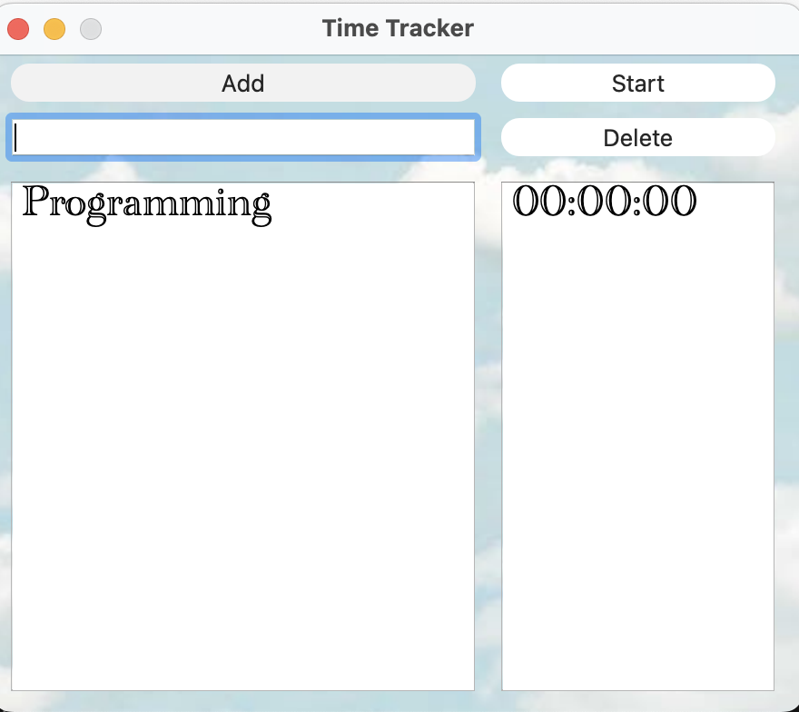
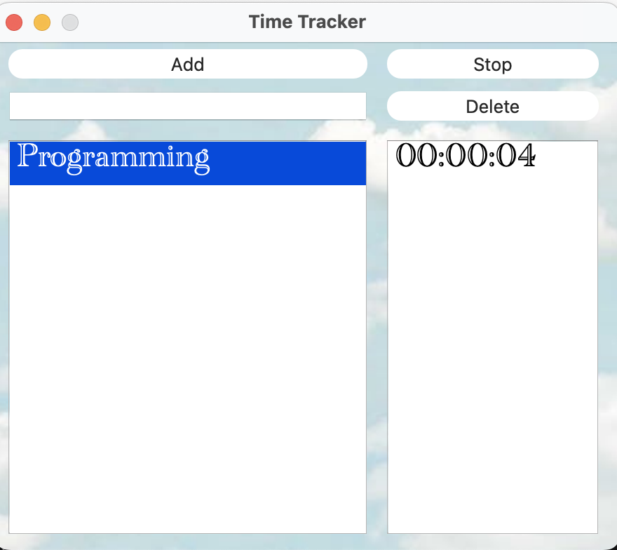

# TimeTracker

## Preview

Print anything into line

----------------------------------------------------------------

Click add

----------------------------------------------------------------

Select the one you need and click start

Also you can stop timer or delete item. Just select item and click Start/Stop/Delete

----------------------------------------------------------------

## Installation instruction

1) Go to terminal
2) Paste this text to terminal one by one

> git clone https://github.com/ket03/TimeTracker.git

> cd TimeTracker

> make install

> open build
 
 ## Other
Also you can:

Uninstall app
> make uninstall

Сlean up the trash
> make clean

Archive directory
> make dist

Open Readme.md
> make dvi